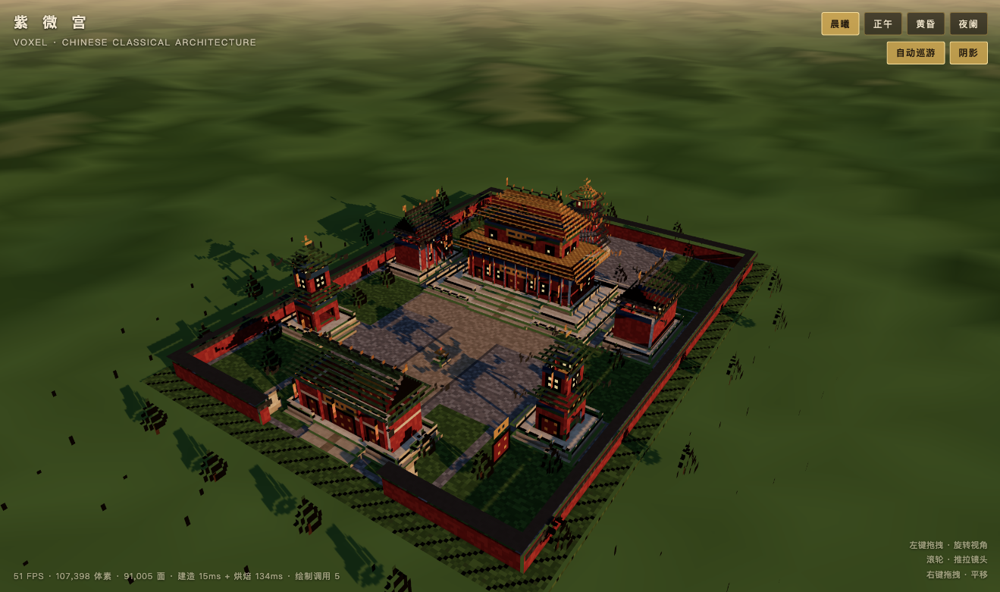
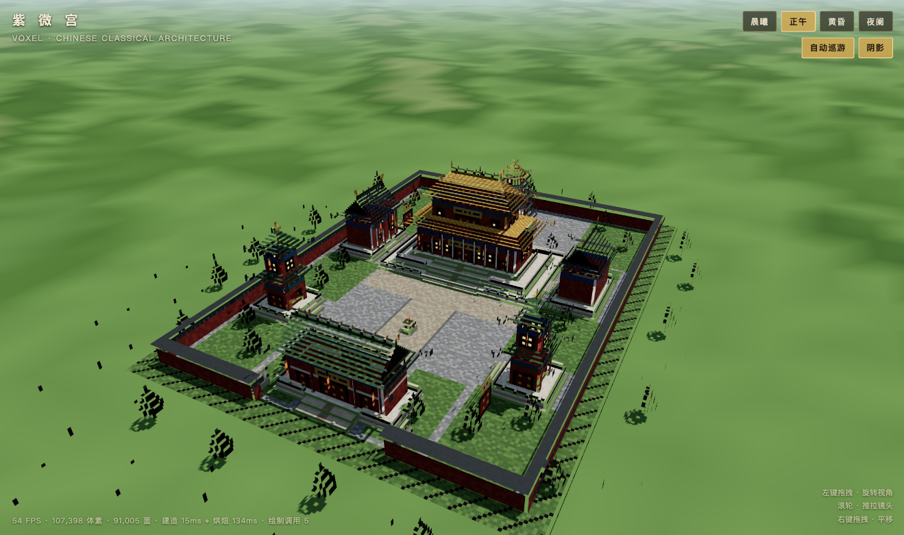
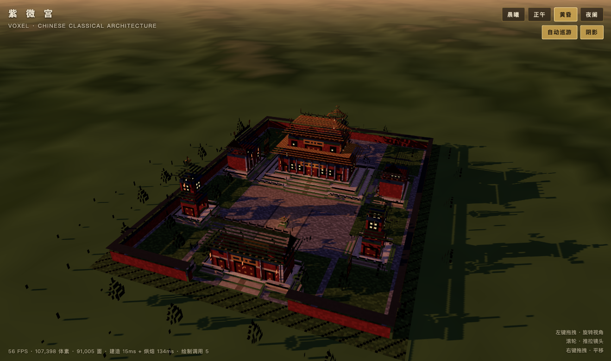
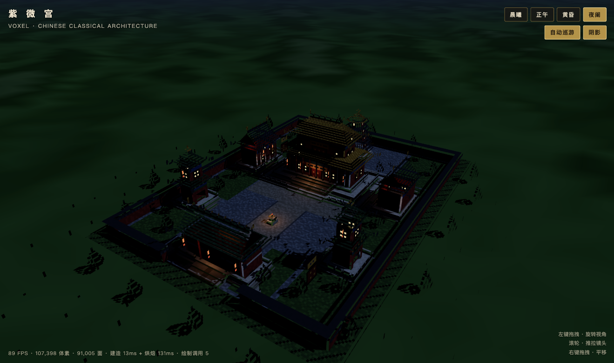

# 紫微宫 · 体素中式古典建筑群

用 **Three.js + Vite** 实现的可运行 3D 体素（Minecraft 风格方块拼接）中国古典院落建筑群。
浏览器打开即自动进入场景：镜头先做一段营造俯冲入场，随后缓慢环绕巡游，无需任何操作即可看到全貌。

| 晨曦 | 正午 |
|---|---|
|  |  |
| **黄昏** | **夜阑** |
|  |  |

> 以上四图均为实际运行截图（自动化 Chromium，1319×781 @1.75 DPR，60 FPS）。

---

## 快速开始

```bash
npm install      # 安装依赖（three + vite）
npm run dev      # 开发模式，默认 http://127.0.0.1:5173
npm run build    # 生产构建，产物在 dist/
npm run preview  # 本地预览生产构建
```

> 若 5173 端口被占用，Vite 会自动改用 5174 等端口，以终端输出为准。
> 构建产物使用相对路径（`base: './'`），`dist/` 可直接丢到任意静态服务器或子目录。

环境：Node 18+（实测 Node 26 / npm 11），无需后端、无需任何 API Key。

---

## 场景内容

### 建筑群（8 座，中轴对称，主次分明）

| 建筑 | 位置 | 屋顶形制 | 说明 |
|---|---|---|---|
| **主殿** | 中轴 z≈-34 | **重檐庑殿顶**（金黄琉璃瓦） | 体量最大，三层汉白玉须弥座台基、御路踏道、檐廊柱、斗拱、匾额 |
| **配殿** ×2 | x=±50, z≈-30 | **歇山顶**（青瓦） | 对称分布于主殿两侧，面向中轴，含山花、博风 |
| **山门** | 中轴 z≈60 | **歇山顶**（绿琉璃瓦） | 场地南端入口，三开间门洞、前后石狮 |
| **钟楼 / 鼓楼** ×2 | x=±50, z≈30 | **攒尖顶**（绿琉璃瓦） | 二层楼阁，一层券门、二层隔扇窗，内悬钟/鼓 |
| **宝塔** | 中轴 z≈-78 | **五层八角攒尖**（青瓦+金顶） | 塔院中轴收头，塔刹、逐层平座腰檐 |

### 空间与动线

```
                  ┌──────── 后墙 ────────┐
      宝塔 ○ 五层攒尖（塔院）
                  │        ↑ 后院甬道
      主殿 █ 重檐庑殿（三层台基）      ← 中轴核心，体量最大
   配殿 ◧ ──┼── ◨ 配殿
   钟鼓楼 ▣  甬道  ▣ 钟鼓楼
      山门 █ 歇山（石狮 / 宫灯）       ← 入口
                  └── 宫墙 · 入口踏道 ──┘
```

- 明确动线：**山门 → 前院 → 金水甬道 → 月台踏道 → 主殿**，另有横向甬路连接东西配殿与钟鼓楼，后院甬道通向宝塔。
- 院内满铺青石板，中轴甬道用暖色御道石并加深色牙子；四隅设草地庭院与松柏，建筑与地面通过台基、踏道自然衔接。

### 建筑细节

飞檐翘角（四角逐级外挑起翘）· 正脊/垂脊/鸱吻/脊兽/宝顶 · 斗拱与额枋彩画 ·
朱红宫墙与束腰线脚 · 汉白玉栏杆（望柱+栏板，踏道处留口）· 御路踏道 ·
隔扇窗（自发光窗纸 + 木棂格）· 板门金钉 · 匾额 · 宫灯 · 石狮 · 铜香炉 · 松柏 · 宫墙墙帽 · 墙外散石。

---

## 技术实现

### 体素几何（`src/voxel.js`）

- **稀疏存储**：`Map<稠密整数key, color|glow>`，避免字符串 key 的 GC 压力。
- **隐藏面剔除**：只输出暴露面，内部体素不产生三角形。约 **10.7 万体素 → 仅 9.1 万面（18.2 万三角形）**。
- **顶点 AO + 方向明暗 + 位置抖动**：Minecraft 风格的环境光遮蔽与肌理，全程无贴图、单材质。
- 地面层下方视为实心（`groundSolid`），省掉整片地面底面。
- 自发光体素（窗纸 / 灯笼）单独烘焙成第二个网格，用 `MeshBasicMaterial` 渲染，昼夜切换时自然"亮灯"。

### 渲染（`src/scene.js`）

- `MeshStandardMaterial`（顶点色）+ 平行光阴影（2048²，正交范围紧贴场地以获得高深度精度），`PCFSoftShadowMap` + `normalBias` 抑制体素自阴影痤疮。
- 半球光 + 环境光 + 6 盏位置光（檐下灯火，夜间亮起形成暖光池）。
- 天空为渐变 ShaderMaterial 穹顶（三段色 + 日轮 + 大气辉光 + 地平霞光），雾色与地平色同步。
- ACES Filmic 色调映射 + sRGB 输出；调色板 hex 统一转线性空间参与光照。
- **时辰预设**：晨曦 / 正午 / 黄昏 / 夜阑，所有光色、强度、雾、天空、灯火、曝光做指数平滑过渡。

### 取景（`src/main.js`）

- 用「每列最高体素」的高度采样点（跳过纯地面列）做**视锥拟合**，逐次放大距离直到建筑群整体入画——既保证全貌，又不被空旷的包围盒角落拉远。
- 入场动画：从高俯角远景沿球面插值到最终机位，3.2s 缓出；结束后交给 `OrbitControls` 自动巡游（用户一旦拖拽即停止巡游）。
- 窗口尺寸变化时自动重新拟合（用户手动操作过则尊重其视角）。

### 性能

| 指标 | 数值 |
|---|---|
| 体素总数 | ≈ 107,400 |
| 暴露面 / 三角形 | ≈ 91,000 / 182,000 |
| 单帧绘制三角形 | ≈ 423,000（主通道 240k + 阴影通道 182k） |
| 建造 + 烘焙耗时 | ≈ 20ms + 180ms（一次性，仅首次加载） |
| 绘制调用 | 5（阴影 / 天空 / 远景地面 / 体素实体 / 自发光） |
| 实测帧率 | **60 FPS**（p50 = 16.7ms，vsync 上限；1319×781 CSS @1.75 DPR） |

整座建筑群合并为 **单个网格**，因此无论多少体素都只有 1 次绘制调用；帧率瓶颈只在阴影贴图与像素填充。

---

## 目录结构

```
.
├── index.html              # 页面骨架 + HUD / 时辰按钮 / 载入遮罩
├── vite.config.js
├── package.json
├── src/
│   ├── main.js             # 组装：建模 → 烘焙 → 场景 → 交互 → 渲染循环
│   ├── voxel.js            # 体素世界（稀疏存储 / 隐藏面剔除 / AO / 几何烘焙）
│   ├── palette.js          # 中式古建色谱（朱红 / 琉璃金 / 青瓦 / 汉白玉 / 彩画）
│   ├── parts.js            # 构件生成器（屋顶 / 台基 / 栏杆 / 踏道 / 斗拱 / 门窗 / 陈设 / 松树）
│   ├── temple.js           # 总平面：地景、宫墙、8 座建筑、陈设与植被
│   └── scene.js            # 渲染环境：天空 / 光照 / 阴影 / 相机 / 时辰预设
└── tools/
    └── inspect-world.mjs   # 无浏览器构建检查：node tools/inspect-world.mjs
```

### 交互

| 操作 | 效果 |
|---|---|
| 左键拖拽 | 旋转视角（自动巡游随即停止） |
| 滚轮 | 推拉镜头 |
| 右键拖拽 | 平移 |
| 右上「晨曦 / 正午 / 黄昏 / 夜阑」 | 切换时辰（光照、天空、雾、灯火平滑过渡） |
| 「自动巡游」 | 开关自动环绕 |
| 「阴影」 | 开关实时阴影，便于对比性能 |

调试入口：控制台 `window.__temple` 可取到 `{ env, world, camera, controls, faces, vstats, dFinal }`。

---

## 实际运行结果

已在本机实际构建并运行验证：

```
$ npm run build
vite v8.3.0 building client environment for production...
✓ 13 modules transformed.
dist/index.html                  2.84 kB │ gzip:   1.40 kB
dist/assets/index-*.js         582.86 kB │ gzip: 148.55 kB
✓ built in 159ms

$ node tools/inspect-world.mjs
体素        : 107,398
自发光体素  : 150
暴露面      : 91,005
三角形      : 182,010
建造 / 烘焙 : 17ms / 178ms
检查通过 ✓
```

浏览器实测（开发模式与 `dist/` 生产构建各跑一遍）：

- 页面正常进入场景，3.2s 入场动画后自动环绕巡游，四个时辰切换正常，阴影/巡游开关正常。
- 页面左下角 HUD 实时显示体素数、面数、构建耗时与绘制调用数。
- **帧率**（`requestAnimationFrame` 帧间隔采样 6s，Apple M1 / ANGLE Metal）：

  | 运行方式 | FPS | p50 | p95 |
  |---|---|---|---|
  | `npm run dev` | 59.7 | 16.6ms | 27.7ms |
  | `npm run preview`（dist/） | 60.0 | 16.7ms | 26.7ms |

  即稳定跑满 60Hz 刷新（vsync 上限，p50 正好等于 16.7ms）。作为对照，把天空/地面/体素网格全部隐藏后帧率仍为 60，说明 GPU 仍有充足余量。
- 无控制台报错，`gl.getError() === 0`；`window.__temple` 可正常访问。

---

## 可调参数速查

| 想改什么 | 改哪里 |
|---|---|
| 建筑尺寸 / 位置 / 屋顶形制 | `src/temple.js` 各 `mainHall / sideHall / tower / gate / pagoda` |
| 屋顶收分陡缓 | `roof()` 的 `step`（1≈45°，2≈27°）、`overhang`（出檐）、`curl`（翘角长度） |
| 色彩 | `src/palette.js` |
| 时辰光照 / 天空 / 雾 | `src/scene.js` 顶部 `PRESETS` |
| 体素明暗层次 | `src/voxel.js` 的 `FACES[].shade` 与 `AO_LEVEL` |
| 相机取景松紧 | `src/main.js` 的 `fitDistance(dir, fill)`（`fill` 越小越松） |
