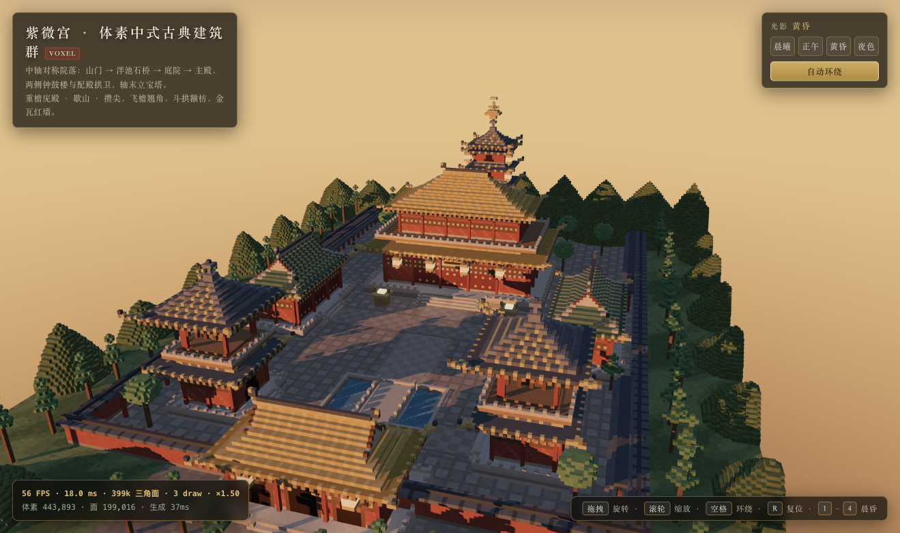

# 紫微宫 · 体素中式古典建筑群（Three.js Voxel Chinese Temple）

用 Three.js 从零构建的 **3D 体素（Voxel / Minecraft 风）中国古典建筑群**。
所有建筑、屋顶、斗拱、门窗、树木、山石、水池都由程序化体素生成器逐块"砌"出来，
浏览器打开即自动推镜进入场景，无需任何操作即可看到全貌。



---

## 一、运行方式

```bash
# 1. 安装依赖（仅 three + vite）
npm install

# 2. 开发模式（自动打开 http://localhost:5173）
npm run dev

# 3. 生产构建 + 本地预览
npm run build
npm run preview        # http://localhost:4173

# 4.（可选）打包成"单个 HTML 文件"，可直接双击用浏览器打开
npm run build:single   # 产物：dist-single/index.html
```

> 环境：Node ≥ 18，无需后端、无需任何外部资源（贴图全部用 Canvas 程序化生成）。

---

## 二、场景内容

### 1. 建筑群（7 座，主次分明）

| 建筑 | 位置 | 形制 | 说明 |
|---|---|---|---|
| **主殿** | 中轴核心 `z=-40` | **重檐庑殿顶**（金琉璃瓦） | 体量最大：台基 74×46，面阔五间，下层腰檐 + 平座栏杆 + 上层身 + 上层庑殿顶，正脊高约 50 体素 |
| **山门** | 场地前端 `z=98` | **歇山顶**（金琉璃瓦） | 三开间、三座门洞贯穿南北，前后石阶，檐下挂灯笼 |
| **东配殿 / 西配殿** | 主殿两侧 `x=±56` | **歇山顶**（绿琉璃瓦） | 严格镜像对称，三间，面朝中轴 |
| **钟楼 / 鼓楼** | 山门内 `x=±46, z=68` | **攒尖顶**（青瓦） | 两层：一层券门 + 腰檐平座，二层开敞亭子内悬钟 / 置鼓，顶置宝顶 |
| **宝塔** | 中轴末端 `z=-92` | **密檐方形塔 + 攒尖顶 + 塔刹** | 六层，层层挑檐收分，八角台基，塔刹为金相轮宝珠 |

### 2. 空间布局（中轴对称院落）

```
                        北（后）
                  ┌──────────────┐
                  │   宝 塔      │   后院 · 松柏 · 假山
                  │   主 殿      │   月台 · 丹陛 · 御道
                  │ 配殿   配殿  │   东西配殿 + 回廊
                  │ 钟楼   鼓楼  │
                  │   泮池·石桥  │
                  └──── 山 门 ────┘
                     石狮 · 前广场
                        南（前）
```

* 动线：**前广场 → 御道 → 山门 → 泮池石桥 → 甬道 → 主殿丹陛**，另有横向甬道通向钟鼓楼与东西配殿。
* 院墙（红墙青瓦压顶）围合成院落，院内方砖铺地，东西两侧设**回廊**（配殿处断开）。
* 院外草地、松柏成行，四角与后山有远山剪影，配合雾气形成纵深。

### 3. 建筑细节

* **屋顶**：`chineseRoof()` 支持庑殿 / 歇山 / 攒尖三种形制；
  用 `pow(p, curve)` 实现中式**举折**（檐口平缓、脊部陡峭），四角做**飞檐翘角**起翘，
  并生成**垂脊、正脊、鸱吻、瓦垄、瓦当、檐椽、博风板、山花**。
* **结构**：须弥座台基（束腰 / 圭角 / 压面石）、汉白玉栏杆、垂带踏跺与丹陛御路、
  **额枋 + 斗拱**（按格挑出并有金色栱眼）、朱红立柱出头、隔扇门（金门钉）、槛窗棂条、匾额。
* **色彩**：红墙、金琉璃（主殿 / 山门）、绿琉璃（配殿）、青瓦（钟鼓楼 / 宝塔 / 院墙）、木色构件。
* **陈设**：石狮一对、灯笼（自发光体素 + 实时光源）、香炉、松树 / 柏树、假山石、泮池石桥。

### 4. 环境与光影

* 地面：土层 + 草地噪声 + 方砖铺装（4×4 一块带砖缝）+ 石板御道（牙子石边线）+ 水系。
* 光照：半球光 + 环境光 + 定向光（**4096 阴影贴图，PCFSoft 软阴影**，覆盖全场 424×424）。
* 天空：程序化竖直渐变天空球 + 太阳辉光 Sprite + 距离雾，与建筑自然衔接。
* **四套晨昏预设**（可面板点选或按 `1`–`4`）：晨曦 / 正午 / 黄昏（默认）/ 夜色，
  夜色下灯笼与窗纸自发光、点光源增强。

---

## 三、技术实现

```
voxel-chinese-temple/
├─ index.html                  页面外壳 + HUD（标题 / 光影切换 / FPS 面板）
├─ vite.config.js              常规构建（多文件）
├─ vite.single.config.js       单文件构建（内联成一个 index.html）
└─ src/
   ├─ main.js                  渲染器 / 相机 / 光照 / 交互 / 主循环 / 自适应分辨率
   ├─ voxel.js                 体素网格数据结构 + 面剔除网格化（mesher）
   ├─ architecture.js          台基、屋顶、斗拱、殿宇、山门、钟鼓楼、宝塔、院墙、陈设生成器
   ├─ site.js                  总平面规划：地面铺装、水系、围墙回廊、建筑总装、绿化远山
   ├─ lighting.js              晨昏光照预设 + 天空 / 辉光贴图
   └─ palette.js               中式配色板
```

### 性能设计（稳定 ≥30fps）

| 手段 | 效果 |
|---|---|
| 体素存 `Uint32Array`（bit24 自发光 + 24bit 颜色，0 为空气） | 44 万体素仅占约 26MB，随机访问 O(1) |
| **只输出暴露面**的网格化（邻居为实心则跳过 6 个面之一） | 44 万体素 → 仅 **19.9 万面 / 39.9 万三角面** |
| 全场合并成 2 个几何体（受光 + 自发光，顶点色烘焙明暗） | **仅 3 个 draw call**（含天空球） |
| 静态阴影贴图（`shadowMap.autoUpdate = false`，仅换光源时重算） | 省掉每帧整场阴影 pass，三角面开销减半 |
| 像素比上限 1.5 + **运行期自适应分辨率**（低于 28fps 自动降档，高于 57fps 回升） | 低端机自动保帧 |
| 点光源限制为 4 个，远景用雾 + 远山剪影 | 片元着色开销可控 |

实测（Apple M1 / Chromium，1325×791 视口，像素比 1.50）：
场景初始化 **≈40–50ms**（44 万体素 → 20 万面），渲染 **60 FPS / 16.7ms / 3 draw call**；
在受限于虚拟机 / 后台限帧的环境里实测掉到 20fps 时，自适应分辨率会自动降档保帧（HUD 中的 `×1.50` 即为当前渲染倍率）。

### 交互

`拖拽` 旋转 · `滚轮` 缩放 · `右键拖拽` 平移 · `空格` 开关自动环绕 · `R` 复位视角 · `1`–`4` 切换晨昏

---

## 四、实际运行结果

* `npm run build` 与 `npm run build:single` 均构建通过（无报错、无警告级问题）。
* 已在 Chromium（WebGL2 / ANGLE Metal，Apple M1）中实际打开页面并截图验证：
  开场动画结束即完整展示建筑群全貌，随后缓慢自动环绕；
  浏览器控制台 **零报错**，HUD 实测 `60 FPS · 16.7ms · 399k 三角面 · 3 draw · ×1.50`；
  键盘 `1`–`4` 切换晨昏、`空格` 暂停环绕、`R` 复位视角均验证可用。
* `dist-single/index.html`（590KB 单文件）已用 `file://` 协议直接打开验证通过，同样 60 FPS。
* 截图见 `docs/overview.png`（黄昏全景）、`docs/hall.png`（主殿）、`docs/night.png`（夜色灯笼）。
