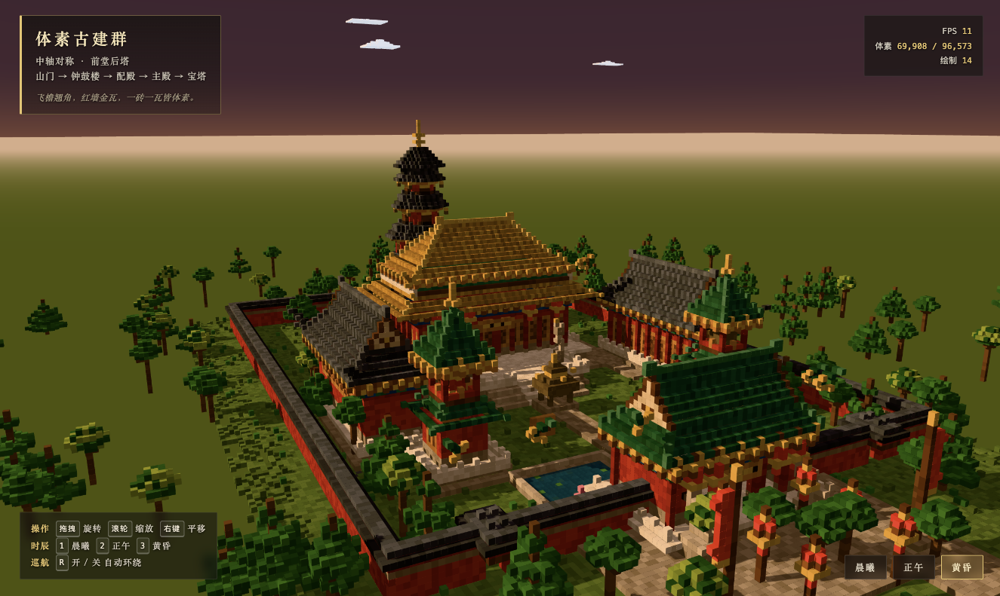

# 体素中式古建群 · Voxel Chinese Courtyard

用 **Three.js** 手工堆砌的一座中轴对称的中国古典建筑群体素场景：山门 → 钟鼓楼 → 配殿 → 主殿（重檐庑殿）→ 宝塔，
全部由 1×1 的方块（voxel）拼成，浏览器打开即可观看，无需后端。



---

## 一、运行方式

```bash
# 1. 安装依赖（仅 three + vite）
npm install

# 2. 自检（约 8 秒；退出码 0 = 全绿，1 = 断言失败）
#    · 无 Chrome 环境自动跳过 render-smoke（SKIP 不计失败），其余约 0.8 秒
#    · VCC_SKIP_RENDER=1 可显式跳过渲染断言
npm run selftest

# 3. 开发模式（默认 http://localhost:5173，自动打开浏览器）
npm run dev

# 4. 或构建后用本地服务器预览
npm run build
npm run preview      # http://localhost:4173
```

> 需求：Node.js ≥ 20.19（或 ≥ 22.12，vite 7 的 engines 要求；README 旧版写的"≥ 18"不成立）。
> 构建产物为纯静态文件（`dist/`），可放到任意静态服务器；
> 由于使用 ES Module，直接双击 `dist/index.html`（file://）无法加载，请用 `npm run preview` 或任意 http 服务。

**操作**：拖拽旋转 / 滚轮缩放 / 右键平移；`1` `2` `3` 切换晨曦·正午·黄昏；`R` 开关自动环绕。
页面载入后先有一段自动推近的开场镜头，随后自动环绕，**无需任何操作即可看到全貌**。

---

## 二、场景内容

### 建筑群（7 座，中轴对称）

| 建筑 | 数量 | 位置 | 形制 |
| --- | --- | --- | --- |
| 主殿 | 1 | 中轴核心 | **重檐庑殿顶**、黄琉璃瓦、面阔 42 格、四层石台基 + 月台、斗拱、彩画、隔扇门、匾额 |
| 配殿 | 2 | 主殿两侧对称 | **歇山顶**（含山花、博风板、悬鱼）、青瓦、前檐廊与檐柱 |
| 山门 | 1 | 场地前端 | **歇山顶**、绿琉璃瓦、三门洞（中央贯通、两侧板门带门钉）、匾额、前后踏道 |
| 钟楼 / 鼓楼 | 2 | 前院东西对称 | 二层：一层墙身 + 腰檐，二层敞轩（内置铜钟 / 立鼓），**攒尖顶 + 宝顶** |
| 宝塔 | 1 | 主殿之后骑中轴 | 八角五层楼阁式塔，层层出檐、檐角风铃，顶置**塔刹** |

### 空间布局

- **中轴动线**：前广场 → 山门门洞 → 御路（中央甬道）→ 钟鼓楼庭院（放生池分列两侧）→ 主殿月台踏道 → 主殿；
  主殿两侧另有甬道通往塔院，形成完整环路。
- **院落围合**：红墙青瓦院墙（厚 2 格）四周围合，正面两侧各开一座掖门（小门楼）。
- **景观**：御路、方砖铺装（2×2 错缝）、草地与草丛、两处放生池（池沿、荷叶、莲花）、
  环场地林带与院内松树/阔叶树、远山已替换为疏林，避免“悬浮台地”。

### 中式细节

- 屋顶：**举折曲线**（下缓上陡，`ins = maxIns · t^0.78` 拟合）、**飞檐翘角**（翼角逐层外挑上扬 + 垫实）、
  正脊与**吻兽**、戗脊/垂脊包脊、瓦垄（隔垄换色）、檐口滴水与走边。
- 结构：**斗拱**层（隔步出挑）、额枋**彩画**（青绿叠晕 + 金线）、立柱与柱础、石台基（须弥座收分）、
  踏道与中央御路、汉白玉栏杆（望柱 + 栏板）、隔扇门窗棂花。
- 陈设：石狮一对、石灯一对、香炉、幡杆一对、灯笼（悬挂式 + 灯杆）、铜钟 / 立鼓。

---

## 三、技术实现

```
src/
├── main.js                 # 渲染器、相机巡航、开场动画、时辰切换、HUD、自适应画质
├── voxel/
│   ├── palette.js          # 中国古典配色色卡（每色 3 个明度档）
│   ├── VoxelBuilder.js     # 体素画笔：set/box/shell/carve/stairs/railing/镜像盖印 → InstancedMesh
│   ├── roof.js             # 屋顶生成器：庑殿 / 歇山 / 攒尖 / 八角檐 / 腰檐 / 翘角
│   └── detail.js           # 构件库：台基、踏道、斗拱、彩画、门窗、石狮、灯笼、香炉、树木…
└── scene/
    ├── layout.js           # 场地总平面（中轴 x = -0.5，镜像映射 x → -1-x）
    ├── buildings.js        # 七座建筑的组合逻辑
    ├── site.js             # 地面、铺装、院墙、水池、林木
    ├── props.js            # 石狮、石灯、灯笼、幡杆、香炉
    ├── sky.js              # 晨曦/正午/黄昏三套天光（天穹着色器 + 平行光 + 半球光 + 雾）
    └── clouds.js           # 体素云
```

### 1. 体素渲染：十万级方块，个位数 draw call

- 所有方块写进一张 `Map<x|y|z → 体素>`，构建完成后按**材质大类**（哑光 / 高光 / 自发光 / 水面）
  合并为 `InstancedMesh`，逐实例颜色写入 `instanceColor`（缓存一张立方体几何体）。
  → 全场景（≈ 9.7 万体素）**仅 14 个 draw call**。
- **不可见体素剔除**：六面被包住的（实心台基内部）与仅底面外露的（铺装之下）直接丢弃。
- **伪 AO + 色阶抖动**：按六邻域占用数对每个实例颜色做轻微明暗衰减，并在调色板内取明度档，
  让同一材质出现自然深浅，体积感更强。
- **确定性哈希**：取色哈希用 `|x + 0.5|` 作输入，保证左右镜像处颜色完全一致（中式对称美学）。

### 2. 中式屋顶的程序化生成

所有屋顶在 (长轴 l, 短轴 s) 局部坐标里计算再映射回世界，因此同一套代码能生成任意朝向与长宽比：

- `hipRoof` 庑殿顶：四坡五脊，正脊长度自动 ≈ 面阔 − 进深；
- `xieshanRoof` 歇山顶：下段四坡 + 上段两坡，两端自动生成竖向**山花**与博风板包边、悬鱼惹草；
- `pyramidRoof` / `octRoof` 攒尖顶与八角檐：逐层收进，顶置宝顶；宝塔即由其叠加成层；
- `skirtRoof` 腰檐 / 重檐下檐：环形出檐，主殿的“重檐”由此实现；
- `eaveCorners` 飞檐翘角：檐角向外上方逐格挑起并垫实，配合四角脊色形成垂脊/戗脊。

### 3. 光影与时辰

- 平行光（带 4096² 阴影贴图，PCFSoft）+ 反向补光 + 半球光 + 微弱环境光；天穹为自定义着色器（三段渐变 + 日晕）。
- 阴影为静态按需渲染：`renderer.shadowMap.autoUpdate = false`，只在切换时辰时重算一次。
- 三套预设插值过渡（1.3 s）：改变太阳方位/高度、光色、天穹、雾、灯笼自发光与曝光。
- 灯笼使用独立自发光材质，黄昏自动点亮（自发光颜色乘实例色，保证暖色）。

### 4. 流畅度

- 目标 60 fps：`pixelRatio` 上限 1.75；帧率持续低于 30 fps 时自动降级（先降分辨率与阴影贴图，再关阴影）。
- 体素总量与 draw call 都在 HUD 实时显示；远处地形用大尺寸实例（scale × 10）以极低开销表现。

---

## 四、自检：可被检验的完成定义

`npm run selftest`（`scripts/selftest.mjs`，约 0.8 秒；有 Chrome 时追加 `render-smoke` 约 8 秒；退出码 0 = 全绿）把"我认为做完了"换成"什么必须为真"。
它走的是**与渲染完全同一条装配流水线**（`src/scene/assemble.js`），因此测的就是要跑的东西。
最后一条 `render-smoke` 例外——它故意**不走**这条流水线，而是起无头 Chrome 打开 `dist/` 构建产物，
把 WebGL 渲染产物本身（shader 编译、program 健康度、自发光传导、GL 错误码、console）变成可机检事实，
专门堵前 17 条覆盖不到的盲区（见下文第 19 条）。

| 断言 | 陈述（必须为真） |
| --- | --- |
| `axis-symmetry` | 每个营造体素 `(x,y,z)` 都存在镜像体素 `(-1-x,y,z)`，**色卡名与明度档都相同**（铺装肌理、瓦垄、彩画、斗拱、望柱、匾额字位、塔刹截面全在内）；有意差异须登记、**逐条计数**，且盒宽收窄到实际足迹 |
| `cull-safety` | 谓词不变量（**mutation-guard**）：`cullVerdict` 对"顶面外露"恒返回 false。它只在谓词被改写时报警，**不是场景证据**（几何回归不会触发它） |
| `cull-effective` | 裁剪**真的发生在渲染产物上**：重算谓词的剔除数 === `stats.total − stats.visible`；关掉裁剪或传 `ao:false` 会立即失败；剔除率须落在 (0, 50%) |
| `axis-walkable` | 中轴动线**真实连通**：z ∈ [-13,50] 逐段 ≥4 格宽，且 z=50 与 z=-13 之间存在 **4-邻接连通路**（flood fill）；地面须为铺装/石作（草地与水面不算路）；山门门洞为空洞 |
| `hierarchy-height` | 五个分区**都非空（只统计营造体素，地形/林木不算）**，且 宝塔 > 主殿 > 配殿/钟楼、山门低于主殿（逐项报告哪项不成立） |
| `hierarchy-mass` | 五个分区都非空（同上口径），主殿体素量最大且 ≥ 配殿 1.5 倍（打印比值，便于发现"两边同时缩小"） |
| `props-and-materials` | 11 项点景/材质实测 ≥ 阈值，且**阈值被基线锁死**：0.5×基线 ≤ 阈值 ≤ 基线（"禁止悄悄放宽"由此可机检）；绿日志打印全部 11 项的 实测/阈值/基线 |
| `voxel-budget` | 总量 ≤ 120,000、可见 ≤ 100,000、**材质批次恰好 4**（4 类材质都在用——少一类说明某类体素整体消失） |
| `roof-generators` | 468 组参数扫描（h ∈ [1,6] × 短边 ∈ [2,14] × **两种脊向** × 三种屋顶）：不抛错、层数非空、收进量充足时逐层严格递增、触及上限时顶层面收敛到 ≤2 格；`h<1` 报错口径清晰 |
| `roof-no-gap` | **屋面不得逐层留缝**：481 组屋顶（含主殿上檐/下檐、山门、配殿、钟鼓楼、宝塔的真实参数）的**平面投影必须铺满檐口矩形**（`skirt` 铺满外檐到 `inner` 的环带、`oct` 铺满八边形）；收进量跳 ≥2 时必须在到达下一环前把中间各环补实 |
| `roof-cornerlift-attached` | **翘角（飞檐）必须挂在檐口上**：从屋面格出发沿切比雪夫 ≤1 必须能走到每一个翘角格；围脊角部起翘的每一格必须能走到同一次输出里的其它格（20 组屋顶、3,132 个翘角/起翘格） |
| `no-airborne-fragments` | **不许有薄的悬空碎片**：按切比雪夫连通分组，不与地面（y ≤ 1）连通的组，要么三向尺寸都 ≥3（实体部件，如钟鼓楼上层的斗拱+攒顶），要么是**登记在案并逐条计数**的悬吊饰物（塔檐风铃，必须是 gold+bronze 成对且落在塔檐范围内）；薄片（5×4×1）与单点（1×1×1）一律失败 |
| `pond-intact` | **两块放生池不得被其它构件吃掉**：水面格必须是 `water/lotus`（y=1）、台明格必须是 `stone2/stone`（y=1）、池沿格必须是 `stone` 或栏板/望柱的 `marble`（y=2）；东池与镜像西池逐格核对（格数随 `layout.pond` 自动变化），被台基/踏道/铺装覆写即失败 |
| `pagoda-circumambulation` | **塔院绕塔必须可行**：贴塔基八角外一圈地面均可站立（无构筑物/树池压在环上），且从院南两行 4-连通可走到院北两行（取样带紧贴南北边，故任何一道横墙都会让它变红） |
| `wall-intact` | **围墙不得被后来的构件侵占**：东西墙、后墙、前墙两段的每一列（y=1..8）都必须是墙自身的色卡（`wallRed/wallRed2/brick/tileGray/tileGray2`），**且压顶外挑一圈（y=7..8）不得被任何非自然物占用**（檐角/翘角伸过来也算）；掖门门洞与山门台基相接段按注释口径剔除 |
| `walk-paths-clear` | **院墙边甬道必须畅通**：四段带子（沿东西院墙各 3 格宽、塔院入口两段横向连接）逐格核对 —— y=1 必须是铺装、上方不得有非自然物（**树冠遮荫不计**），且每段各自首尾 4-连通（随机林木不得长在路上） |
| `noon-shadow-north` | **日轨必须在南半空间**：晨曦/正午/黄昏三个预设的 `dirOf().z` 都 > 0（否则正午阴影朝南，北半球反了）、正午最偏南且最高、晨曦与黄昏分居东西（太阳横穿天空），且正午阴影（−dir）必须朝北 |
| `render-smoke` | **渲染产物本身必须是真的**（唯一需要浏览器的一条；无 Chrome 则 SKIP，不计失败）：起无头 Chrome 打开 `dist/`，断言 ① 无 console 错误/未捕获异常；② `renderer.info.programs` 全部 `runnable`（**没有 shader 编译失败**）；③ `gl.getError() === 0`；④ `glow` 材质 `emissiveIntensity > 0`（`setGlowIntensity` 真的传到了网格，而不是传给了另一个材质对象）；⑤ draw call 与三角形数 > 0；⑥ 渲染可见体素数 === 装配流水线的 `stats.visible`。注入探针用 page 级 console 钩子，避免把 favicon 404 之类网络层日志误判为页面错误 |

**它真的抓到过东西**（都是截图上看不出来的，按发现顺序）：

1. 铺装方砖错缝相位左右反相；2. 屋面瓦垄左右**反相**（中轴上不是同一条垄）；3. 栏杆望柱两侧柱位错位；
4. **宝塔八角平面中心在 `x=0` 而非中轴 `x=-0.5`**，整塔偏半格（台基/塔身/塔檐/斗拱/风铃/塔刹全改骑轴对称）；
5. 院外林木树冠长进后墙、压在广场铺装上（新增 `onBuilt()` 邻域检查）；
6. **香炉卡死中轴**：香炉骑中轴、御路仅 6 格宽而绕行处全是草地 ⇒ 动线实际不可通行（补月台前坪铺装后才连通）——由加固后的 `axis-walkable`（flood fill + 地面材质约束）发现；
7. **豁免盒比理由宽 12 倍**（2970 格 vs 乐器实际 250 格）⇒ 收窄到实际足迹后，豁免体素由 567 降到 **121**，其余全部回到断言覆盖内；
8. **阈值无锚点**：11 个阈值与实测的比值散布在 7%–55%，README 原先声称的"~55%"并不成立；引入 `BASELINE` 后才可机检；
9. **谓词自证**：`cull-effective` 原先自算一遍谓词、与渲染路径无关 ⇒ "关掉裁剪"也能全绿（现已绑定 `toObject3D` 产物）；
10. **屋顶逐层跳步留下贯穿镂空**（主殿上檐少 338 列、下檐 300 列、山门 102 列、配殿东西各 100 列）：**这条是肉眼先发现的**，而当时 9 条断言全部为真 ⇒ 说明缺的不是"更强的眼睛"，而是一条把"屋面不得留缝"写成可机检陈述的断言（现为 `roof-no-gap`）；
11. **飞檐翘角被发射到别处**（山门周围一圈游离单格）：`eaveCorners` 把 `put(l, s, y, key)` 的 **s 与 y 传反** —— 初始提交即如此，每个翘角体素都落到 (x0+l, y=ds, z0+(y+up))，即 y≈0 的地下或 y≈S 的半空。同样是**肉眼先发现**、而 10 条断言全绿 ⇒ 新增 `roof-cornerlift-attached`（从屋面沿切比雪夫 ≤1 必须能走到每个翘角格）。
12. **水池边悬着两块木格栅**（钟鼓楼南北两面槛窗）：`latticeWall` 的 `axis:'x'` 要求 `a0/a1` 是 **x 坐标**，代码却传了 z 范围（13..17），于是 5×4 的格栅被发射到塔西侧 15 格外的半空（东西两塔 × 南北两面 = 4 块），**而塔身南北面反而没有窗**；同一扫描还挖出香炉四只金耳探出 2 格但中间没有连接格。⇒ 新增 `no-airborne-fragments`；
13. **放生池被山门台基与北踏道吃掉**（水面 22 格 + 台明 52 格，大理石台阶压在池水上方）：池原取 `x[7,22] z[26,38]`，南缘越过山门台基线（z=37）、西缘落在北踏道 x 带（x ≤ 8）内 ⇒ 先改 `x[12,27] z[26,34]` 去冲突，再按「贴中轴路 + 与钟鼓楼对中」定为 `x[7,19] z[15,23]`，最后按用户要求长宽对调为 **`x[7,15] z[13,25]`**（9×13，长轴与御路平行，西缘仍距路 2 格、池心仍 z=19）；并新增 `pond-intact` 逐格断言；
14. **塔院是一片 39×41 的空石板**（塔高 63 格独处其中、院内树 0 株）：按用户选定补景——南踏道两侧石灯一对、四角松柏 4 株+树池（四角）、碑亭两座（宝塔东西两侧、骑 z=84 中线）、院边回纹带+轴线甬道南北两段；并新增 `pagoda-circumambulation`（贴塔基环道 70 格可站立 + 南→北 4-连通），防止后续补景堵住绕塔；
15. **碑亭与围墙重叠**（用户看出）：碑亭起初放在院北两角，檐口与台明北沿（z=-104）正好落在后墙那一行上，把墙的 `wallRed`/压顶换成了亭子的石作 —— 而当时 14 条断言全绿（没有任何一条管围墙完整性）⇒ 新增 `wall-intact`（五段院墙 footprint 7,648 格逐格核对 + 压顶外挑一圈不得被占）；
16. **亭檐翘角仍会碰墙**（推到 z0=-101 时被 `wall-intact` 当场拦住）：裕量必须按**檐角**算 —— 后墙压顶外挑 1 格 + 亭檐翘角再挑 2 格（`reach:2`），故北沿只能到 z=-102、`z0 ≤ -99`。碑亭现取 `x[-19,-15] z[-99,-95]`（用户要求放回院北两角空地），松柏随之改到南两角 + 东西两侧中点；
17. **甬道被画进后墙 / 树冠被误判为阻塞**：塔院两侧新增“沿墙甬道 + 入口连接段 + 松林”后，`walk-paths-clear` 第一次运行就报 `(-53,1,-104) 是 wallRed`（北端画到了后墙那一行）⇒ 收到 z=-103；接着又报 `(-53,3,-96) 被 leaf2 占` —— 那是树冠搭在路**上方**（自然，允许）⇒ 口径改为“只禁非自然物”，树干长在路上会直接毁掉 y=1 铺装、由第一句拦下。随后按用户反馈把两侧林改为**稀疏随机**：局部固定种子 RNG 撒点（不动公共 rnd 序列）+ 最小间距 9 格 + `onBuilt` 避障 + **松/阔混搭**（每侧 7 株，树冠量从各 ~1,700 格降到 ~800 格）。再按用户反馈二次稀疏：每侧 4 株、最小间距 12 格，树冠量 480 / 384 格。
18. **正午阴影朝南（= 北半球反了）**：`SkyRig.dirOf` 把 z 写成 `+cos(el)cos(az)`，将整条日轨镜像到北半空间 —— 正午 `az=205/el=62` 算出 `z=-0.425` ⇒ 太阳在北边 ⇒ 阴影朝南。用户只注意到正午（黎明/黄昏 z 仅 ∓0.22，东西向主导，看着“还行”）。修法是**一个符号**（`-cos`）：修改后晨曦 `z=+0.22`（日出偏南）、正午 `z=+0.43`（最偏南）、黄昏 `z=+0.23`（日落偏西）；由于天穹日晕/太阳圆盘/平行光共用此向量，一处生效。新增 `noon-shadow-north` 把“日轨在南半空间”变成可机检事实。
19. **17/17 全绿，但灯笼是坏的**（2026-09-23 发布前复验时发现）：两个 P0 都只坏在 **WebGL 渲染产物**上，而前 17 条断言只覆盖装配流水线的体素数据 ⇒ 数据一个不少、断言全绿、画面上灯笼整个消失。
    - **P0-1 shader 编译失败**：`onBeforeCompile` 注入 `totalEmissiveRadiance *= vColor`，而 three 0.186 启用 `instanceColor`（`USE_INSTANCING_COLOR`）时 `varying vColor` 是 **vec4** ⇒ `vec3 *= vec4` GLSL 编译失败 ⇒ glow 材质批次整体不渲染，控制台持续 `Shader Error` + `useProgram: program not valid`。修法：取 `vColor.rgb`。
    - **P0-2 自发光强度传不到网格**：`toObject3D()` 内 `const mats = makeMaterials()` **每次调用新建一套材质**，而 `setGlowIntensity()` 每帧改的是模块级 `MATS` —— 两者不是同一对象 ⇒ 灯笼 `emissiveIntensity` 恒 0，永远不亮（`setWaterOpacity` 同样失效，只是暂无调用点）。修法：复用 `MATS` 单例。
    ⇒ 新增 `render-smoke`：起无头 Chrome 打开 `dist/`，把 shader 编译、program 健康度、`emissiveIntensity` 传导、`gl.getError()`、console 变成可机检事实。这与本文档对 `cull-safety` 的自我批评是同一条：**自算一遍 ≠ 渲染路径真的如此**。

**验证它有牙齿**（故障注入，每次都在改动之后复验）：

| 注入 | 期望 | 实测（退出码 / 信息） |
| --- | --- | --- |
| `cullVerdict` 的 `belowEmpty` 取反（最初那个真实 bug） | `cull-safety` 失败 | 1 / `8651/47083 个顶面外露体素被误剔除，例如 (-48,0,8) ridgeGray` |
| 渲染路径不再调用 `cullVerdict`（= 关掉裁剪） | `cull-effective` 失败 | 1 / `谓词剔除 26,642 · 渲染产物剔除 0 ✗ 不一致`（`voxel-budget` 仍绿 ⇒ 它单独挡不住） |
| 只放宽阈值（`NEED.lanternLite = 8`，基线不动） | 阈值越界 | 1 / `阈值 8 越界（基线 32，允许 16–32）` |
| 注入非镜像体素 | `axis-symmetry` 失败 | 1 / `(3,12,12) wallRed ↔ 空` |
| 撤掉 `roof.js` 的踏步填实（回到修复前） | `roof-no-gap` 失败，其余 9 条仍绿 | 1 / `318 项失败：hip 18×6 h=2 缺 34 列，例如 (1,1) (1,2) (1,4) …` |
| 把 `eaveCorners` 的 `put(l,s,y)` 参数传反（= 初始提交的 bug） | `roof-cornerlift-attached` 失败，其余 10 条仍绿 | 1 / `16 项失败：xieshan 山门: 40/40 个翘角格从屋面走不到，例如 (-1,-1,15) (-1,-1,14) (-1,0,15)` |
| 钟鼓楼槛窗 `a0/a1` 传 z 范围（= 0 初始提交的 bug） | `no-airborne-fragments` 失败，其余 11 条仍绿 | 1 / `4 处薄片：20 格 5×4×1 @ x[13,17] y[6,9] z[19,19] wood2,wood3 | … z[11,11] | …` |
| 香炉金耳去掉连接格 | `no-airborne-fragments` 失败 | 1 / `4 处薄片/单点悬空：1 格 1×1×1 @ x[-5,-5] y[9,9] z[-2,-2] gold | 1 格 @ x[4,4] | 2 格 2×1×1 @ x[-1,0]` |
| 把 `pond` 矩形改回旧值 `x[7,22] z[26,38]` | `pond-intact` 失败，其余 12 条仍绿 | 1 / `66 格被占（共查 820）：东池沿 (5,2,35) 被 stone2 占用 | 东池沿 (5,2,38) | …` |
| 塔院环道上对称压两格（x=±14 与 13，z=-84） | `pagoda-circumambulation` 失败 | 1 / `环道被堵 2 格：(-14,-84) (13,-84)` |
| 塔院南岸一道全宽墙（z=-67，压在树池之后） | `pagoda-circumambulation` 失败 | 1 / `南侧走不到北侧（可站立 81 格，北岸种子 70 个均未连通）` |
| 碑亭移回院北两角（= 与院墙重叠） | `wall-intact` 失败，其余 14 条仍绿 | 1 / `围墙 footprint 被侵占（共查 7,648 格）：(-20,1,-104) 是 stone2 | (-20,7,-104) 是 ridgeGray | …` |
| 碑亭再往北推 2 格（檐角翘角碰压顶外挑） | `wall-intact` 失败 | 1 / `围墙 footprint 被侵占：(-22,8,-104) 是 ridgeGray | (-20,8,-104) 是 gold | (-14,8,-104) 是 gold | …` |
| 一棵树干塞在西侧甬道上（x=-52, z=-20） | `walk-paths-clear` 失败 | 1 / `1 项失败：西侧沿墙 被阻 1 格：(-52,1,-20) 是 trunk` |
| 把 `dirOf` 的 z 符号改回 `+cos(el)cos(az)`（= 用户报的“阴影相反”本身） | `noon-shadow-north` 失败 | 5 / `dawn 太阳偏北（z=-0.221，应为正）—— 阴影会朝南；noon 太阳偏北（z=-0.425…）；dusk 太阳偏北（z=-0.231…）；正午不是最偏南的预设；正午阴影不朝北（−dir.z=0.425）` |
| 把 `vColor.rgb` 改回 `vColor`（= P0-1 本身） | `render-smoke` 失败，其余 17 条仍绿 | 1 / `console 错误 1 条：THREE.WebGLProgram: Shader Error 0 - VALIDATE_STATUS false` |
| 把 `const mats = MATS` 改回 `makeMaterials()`（= P0-2 本身） | `render-smoke` 失败，其余 17 条仍绿 | 1 / `glow emissiveIntensity=0 —— setGlowIntensity 没传到网格（材质对象被换掉）` |
| `VCC_SKIP_RENDER=1` 或 dist/ 缺失 | `render-smoke` 记 SKIP（不计失败） | 0 / `18/18 通过（实跑 17 条，跳过 1 条）` |

> 该命令同时是 subagent 的 `gate`：任何改动本仓库的子 agent 都必须让它跑通并在 `commandsRun` 里留痕。
> 已知残余弱点：`BASELINE` 本身不受该断言保护（改基线则阈值整体跟随），保护手段是 git diff 与绿日志里打印的基线值。

## 五、实际运行结果

在本机（macOS / Apple M1 / Chrome，窗口 1325×791，`pixelRatio 1.75`）实测：

| 指标 | 数值 |
| --- | --- |
| 体素总数 / 可见 / 被剔除 | **97,819 / 70,227 / 27,592（28.2%）** |
| Draw call | 全场景 **14**（其中体素 4 批：哑光 / 高光 / 自发光 / 水面） |
| 三角形 | ≈ 86 万 |
| 单帧渲染（含阴影采样） | 修复前 **6.0 / 6.3 / 8.7 / 9.2 ms**（四轮独立测量，默认全景机位）；修完屋面/飞檐/水池各版本的同环境实测中位数落在 **4.8–7.7 ms**（min 4.5 / max 23.1，pixelRatio 1.75）—— 注：单帧值随测量机位与后台负载波动，只有同机位对照才有意义 |
| 场景构建（装配 + 合批） | 45–100 ms |
| 自检 | **18/18 通过、退出码 0**（约 8 s，含无头 Chrome 渲染断言；无 Chrome 时 17 条实跑 + 1 条 SKIP） |

> 说明：HUD 的 FPS 在窗口失焦/后台标签会被浏览器节流，不作为结论依据；上表为 `renderer.render()` 循环 + `readPixels` 同步实测。
> 本仓库已纳入 git（`npm run selftest` 为 gate），改动报告应附 `git rev-parse --short HEAD` 与干净的 `git status`。

## 六、发布

线上地址：**https://sutang-vain.github.io/voxel-chinese-arch/04/**（GitHub Pages，`gh-pages` 分支 `/04/` 子路径）

```bash
npm run build          # 产出 dist/（18 modules → 2 文件，808K，JS gzip 213K）
# dist/ 为纯静态产物：base:'./' 全相对路径，零外部依赖，可放任意静态托管
```

- `vite.config.js` 用 `base: './'` ⇒ 构建产物可挂在**任意子路径**（本仓库即 `/04/`，与根目录的 03 项目共存）
- 无需后端、无路由、无环境变量；ES Module ⇒ 必须经 http(s) 访问，`file://` 不行
- 部署方式：`dist/` 推到 `gh-pages` 分支即可（本仓库用 legacy Pages，无 CI）；也可用 Netlify / Vercel / Cloudflare Pages / OSS+CDN
- 服务端建议开 gzip/brotli（JS 213K ⇒ 传输量降约 74%）
- Node 要求：`^20.19.0 || >=22.12.0`（vite 7 的 engines）

**调试入口**：控制台可用 `window.__vcc` 访问 `{ THREE, scene, camera, controls, renderer, sky, stats }`，
例如 `__vcc.controls.autoRotate = false` 暂停巡航。
